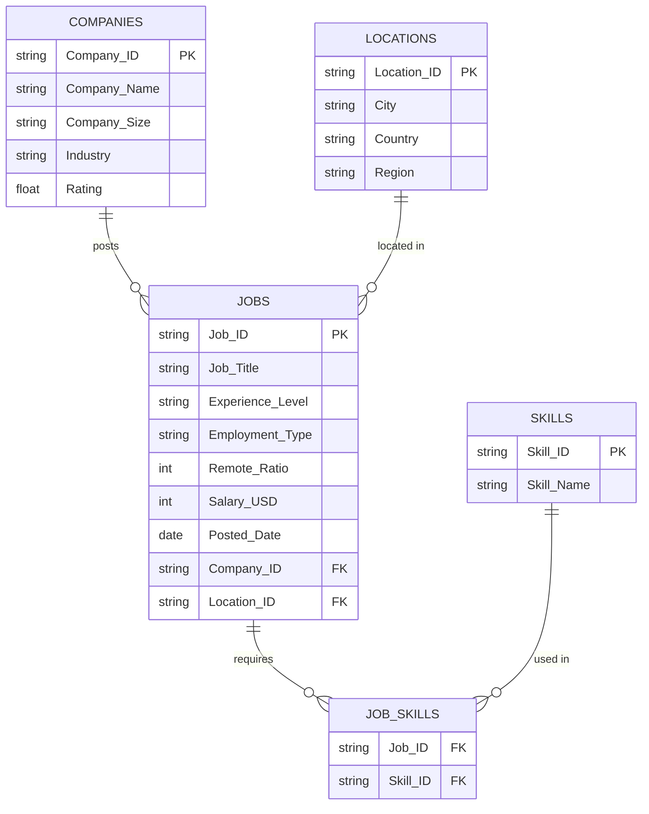

# 🤖 AI & ML Jobs Dataset Analysis

<p align="center">
  
  
  
  
</p>

<p align="center">
  An interactive Power BI analysis of AI & Machine Learning job postings — exploring salaries, remote-work trends, in-demand skills, and hiring companies across global markets.
</p>

---

## 📌 Overview

This project analyzes a curated dataset of **AI/ML job postings** to uncover patterns in compensation, seniority, remote work, and skill demand across the industry. The data is modeled in a relational (star-schema) structure and visualized in an interactive **Power BI dashboard**, making it easy to slice job market trends by role, company, location, and skill.

**Business questions this project explores:**
- 💰 How does salary vary by experience level and role?
- 🌍 Which locations and companies offer the most AI/ML opportunities?
- 🏠 How prevalent is remote work in AI/ML roles?
- 🧠 Which technical skills appear most frequently in job requirements?
- 🏢 What kind of companies (size, industry) are hiring the most?

---

## 🗂️ Repository Structure

```
AI--ML-Jobs-Dataset-Analysis/
│
├── Jobs.csv                          # Core fact table — job postings
├── Companies.csv                     # Dimension table — hiring companies
├── Locations.csv                     # Dimension table — job locations
├── Skills.csv                        # Dimension table — technical skills
├── Job_Skills.csv                    # Bridge table — many-to-many job↔skill mapping
├── AI- ML Jobs Dataset Analysis.pbix # Power BI dashboard file
└── README.md                         # Project documentation
```

---

## 🧬 Data Model

The dataset follows a **star schema**, with `Jobs` as the fact table connected to four dimension tables. `Job_Skills` acts as a bridge table to resolve the many-to-many relationship between jobs and skills.



### Table Reference

| Table | Description | Key Fields |
|---|---|---|
| **Jobs** | 10 AI/ML job postings | `Job_ID`, `Job_Title`, `Experience_Level`, `Employment_Type`, `Remote_Ratio`, `Salary_USD`, `Posted_Date` |
| **Companies** | 5 hiring organizations | `Company_ID`, `Company_Name`, `Company_Size`, `Industry`, `Rating` |
| **Locations** | 5 global hiring hubs | `Location_ID`, `City`, `Country`, `Region` |
| **Skills** | 10 in-demand technical skills | `Skill_ID`, `Skill_Name` |
| **Job_Skills** | Bridge table linking jobs to required skills | `Job_ID`, `Skill_ID` |

---

## 📊 Quick Insights

A few headline numbers pulled directly from the dataset:

| Metric | Value |
|---|---|
| Total job postings analyzed | 10 |
| Average salary (USD) | **$93,400** |
| Highest-paying role | Deep Learning Specialist @ NVIDIA — **$132,000** |
| Entry-level average salary | $49,000 |
| Senior-level average salary | $125,000 |
| Average remote-work ratio | **59%** |
| Most in-demand skill | **Python** — required in 9 of 10 postings |
| Companies represented | 5 (OpenAI, Google DeepMind, Hugging Face, NVIDIA, DataCamp) |
| Hiring locations | San Francisco, London, Bengaluru, Toronto, Berlin |
| Most common employment type | Full-time (7 of 10 postings) |

> 💡 Notably, seniority has a strong pull on pay — the jump from entry-level to senior roles corresponds to a **~2.5x increase** in average salary in this dataset.

---

## 🛠️ Tools & Tech Stack

- **Power BI Desktop** — data modeling, DAX measures, and interactive dashboard
- **CSV / Relational Data Modeling** — star-schema design (fact + dimension tables)
- **DAX** — calculated measures for salary aggregation, skill frequency, and remote-work analysis

---

## 🚀 Getting Started

### View the Dashboard
1. Install [Power BI Desktop](https://powerbi.microsoft.com/desktop/) (free).
2. Clone or download this repository.
3. Open `AI- ML Jobs Dataset Analysis.pbix` in Power BI Desktop.
4. Explore the report pages, slicers, and visuals interactively.

### Explore the Raw Data
All source tables are available as plain CSVs (`Jobs.csv`, `Companies.csv`, `Locations.csv`, `Skills.csv`, `Job_Skills.csv`) if you'd like to build your own model in Power BI, Tableau, Excel, or Python/pandas.

```bash
git clone https://github.com/theaditya24/AI--ML-Jobs-Dataset-Analysis.git
cd AI--ML-Jobs-Dataset-Analysis
```

---

## 🔮 Possible Extensions

- [ ] Expand the dataset with more postings for stronger statistical trends
- [ ] Add year-over-year posting trends once multi-year data is available
- [ ] Build a Python/pandas notebook for exploratory data analysis alongside the Power BI report
- [ ] Publish the report to Power BI Service and embed a live dashboard link here

---

## 👤 Author

**Aditya**
GitHub: [@theaditya24](https://github.com/theaditya24)

---

## 📄 License

No license is currently specified for this repository. If you'd like others to freely reuse or build on this work, consider adding an [MIT License](https://choosealicense.com/licenses/mit/).

---

<p align="center"><i>⭐ If you found this project useful, consider giving it a star!</i></p>
